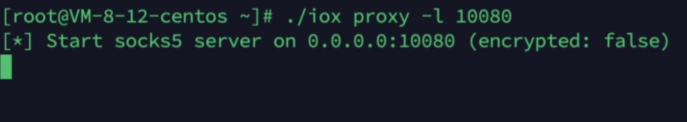
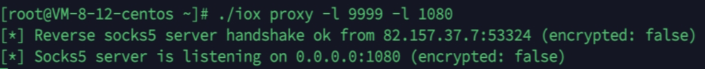
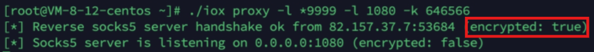
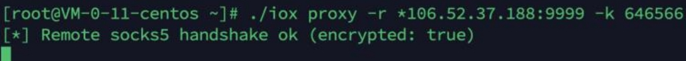

# 代理工具IOX

在渗透或者CTF过程中，经常遇到多层级内网需要进入的问题。通常使用的有FRP等内网穿透工具，但在时间进场需要快速验证的时候，IOX有其独特的优势，就是不用配置，一个命令即可快速开启正向或者反向代理。

## 正向代理：

```
iox proxy -l <监听端口号>
```



执行后该主机的10080端口即开始监听socks5接入

## 反向代理

```shell
# 外网主机作为转发端
iox proxy -l <接收内网主动连接的iox端口> -l <监听工作端口>

#内网主机发起反向连接端
iox proxy -r <上面的主机ip>:<上级主机接收主动连接的端口>
```

中转机上启用监听内网主动反向，并指定对外服务端口



内网主动向上层网络反向连接到指定的代理端口9999


## 代理流量加密

在加密端口加`*`进行标注，然后-k 指定加密密码，用于增加流量被识别难度

```shell
./ioxproxy -l *9999 -l 1080 -k 646566 
```



*注意：只是在两个iox客户端之间的流量进行了加密，并没有加密对外服务的流量*

对应的连接客户端在ip和端口号进行`*`标注

```shell
./iox proxy -r *x.x.x.x:9999 -k 646566
```




实际应用中快速启动，快速撤退，经测试性能足够
