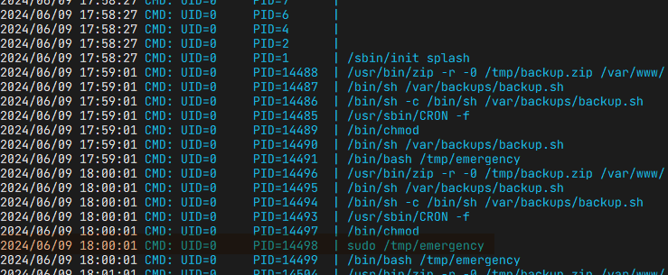

# 靶机 DriftingBlues：1

## 1、获取靶机

[DriftingBlues: 1 ~ VulnHub](https://www.vulnhub.com/entry/driftingblues-1,625/)

下载之后导入virtualbox开启靶机

## 2、获取靶机位置

由于靶机启用的是桥接网卡模式，独自获得了子网的ip，因此用`arp-scan`找到靶机的ip


## 3、探测靶机对外服务

用nmap -sS 扫描发现靶机的22，80端口开放，访问80有一个对外服务的web


## 4. 搜集信息

- 在页面上找到两个e-mail地址
  
  

- 在页面源代码中找到一个可疑base64编码
  
  
  
  - 对base64进行解码获得一个txt文本的路径:
    
    
  
  - 查看txt内容获取一堆加密字符
    
    
  
  - 通过在线解密网站尝试对加密内容解密https://www.dcode.fr/cipher-identifier，获取到一串提示文字：
    
    
    
    文字内容：`my man, i know you are new but you should know how to use host file to reach our secret location. -eric`

- 根据提示信息要从host解析文件中寻找隐藏的路径，修改host文件将靶机ip地址解析到前面获取的邮箱地址域名
  
  

## 5. 渗透测试

### 5.1. 对靶机vhost进行爆破

- 通过`ffuf`工具对已经写入hosts文件的域名靶机进行vhost爆破
  
  ```
   ffuf -w ./Discovery/DNS/bitquark-subdomains-top100000.txt -u http://driftingblues.box -H 'Host: FUZZ.driftingblues.box' -fs 7710
  ```
  
  ffuf在kali中已经集成
  
  -w ./Discovery/DNS/bitquark-subdomains-top100000.txt 指定了字典文件路径
  
  -u 指定了要爆破的主域名
  
  -H 'HOST: FUZZ.driftingblues.box' 指定了爆破的格式，即FUZZ字符占位的位置用字典进行尝试
  
  

- 找到一个新的vhost配置：`test.driftingblues.box`,将vhost的解析添加到hosts中，进行目录爆破：
  
  `dirsearch -u http://test.driftingblues.box`
  
  

- 找到一个可以访问的`/robots.txt`文件，里面提供了新路径提示信息
  
  

- 在/ssh_cred.txt中看到密码提示,提示前缀后面加数字即是密码
  
  

- 根据密码结构提示，利用`crunch`工具来生成密码字典
  
  crunch：
  
  13 13 生成密码长度最短13，最长13
  
  -t 后续指定字符串中的%为数字
  
  

- 利用生成的字典进行爆破
  
  

- 用爆破结果登录ssh，继续搜集信息
  
  

- 监控系统进程，寻找到root权限执行的进程
  
  借助工具`Pspy`（https://github.com/DominicBreuker/pspy/releases）,进行系统进程监控
  
  
  
  发现一个以root身份定时执行的脚本任务：
  
  
  
  由于脚本所处位置为/tmp，当前用户有完全控制权限

- 修改定时执行任务执行的脚本，获取反弹shell和root身份，拿到flag
  
  
  
  等脚本再次被计划任务执行时，获取到反弹shell
  
  

- 在root目录下找到flag，完成渗透


